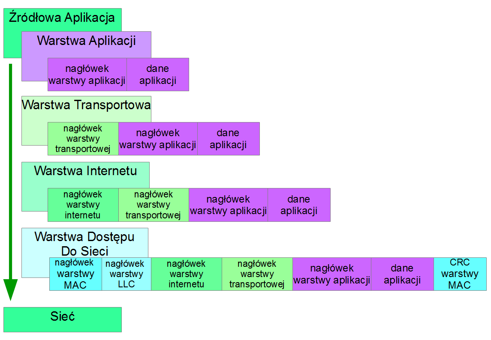

# TCP/IP
1. Transmission Control Protocol/Internet Protocol - warstwowy model sieci opisujący sposób łączania różnych komputerów, systemów operacyjncyh i komputerów w jedną, uniwersalną sieć z wykorzystaniem całej rodziny protokołów komunikacyjnych (rodzaj sprzętu jak i oprogramowania nie ma znaczenia). 
2. Jak przebiega komunikacja?
   * pakiet - specjalnie "opakowany" fragment danych, które chcemy przesłać, zwiera info:
     * IP komputera z którego został wysłany
     * IP komputera docelowego
     * jakie dane przenosi
     * czas życia pakietu
   * Pakiety są przesyłane najbardziej optymalną drogą, jesli dany pakiet przez dłuższy czas nie jest w stanie odnaleźć adresata, zostaje uśmiercany na podstawie czasu życia pakietu
   * W skrócie dane wysłane przez aplikację przechodzą przez wszystkie warstwy modelu TCP/IP (od warstwy aplikacji, do najniższej warstwy dostępu do sieci), następnie transmitowane są przez sieć do drugiego komputera, po dostarczeniu przechodzą kolejno przez wszystkie warstwy w odwróconej kolejności (od warstwy dostępu do sieci do warstwy aplikacji i docelowego procesu) na przykład:
     * Węzeł A (np. serwer świadczący usługę ze streamingiem muzyki) w odpowiedzi na zapytanie klienta chce przesłać na wskazane urządzenie piosenkę (strumień danych), którą przed wysłaniem dzieli na pakiety i wysyła kolejno do urządzenia użytkownika
     * pakiety przesyłane są przez sieć rozległą, miejsce docelowe jak i nadawca są zapisane w pakiecie
     * Węzeł B (np. telefon z apką spotify) kolejno odbiera pakiety danych, na podstawie informacji w nich zawartych skleja je z powrotem w strumień danych stanowiący całość, sprawdza sumę kontrolną (czy wszystkie pakiety zostały dostarczone i sklejone poprawnie)
   * Dane które chcemy wysłać są odpowiednio modyfikowane przez każdą z warstw modelu TCP/IP, w każdej z nich zmienione dane są opatrzane odpowiednim nagłówkiem (header'em) identyfikującą daną warstwę - dzięki temu proces przygotowania danych do wysłania, na komputerze docelowym może zostać odwrócony tak by uzyskać dane w pierwotnej postaci, które moga zostać odpowiednio zrozumiane przez warstwę aplikacji.
     * 
3. Warstwy
   1.  APLIKACJI - NAJWYŻSZA
      * pośredniczy w komunikacji pomiędzy programami i protokołami niższych warstw, wykorzystuje np protokoły HTTP, FTP, SMTP czy DNS,
      * w zależności od wybranego protokołu dane przesyłane do niższej warstwy moga się różnić - NIE MA TO ZNACZENIA
   2. TRANSPORTOWA
      * otrzymuje wiadomości z warstwy aplikacji, dzieli je na mniejsze pakiety, dodaje swój własny nagłówek, który zawiera m.in. info o numerach portów nadawcy i odbiorcy, następnie przesyła dane do warstwy niższej
      * numery portów przy odbieraniu danych (kiedy dane wędrują od warstwy najniższej do najwyższej) są wykorzystywane do określenia typu przesyłanych danych (dane kierowane do danego portu mają swoją charaktrystykę - dane porty są skojarzone z konkretnymi danymi), na podstawie typu danych dobierany jest odpowiedni protokół warstwy aplikacji, który powinien otrzymać wiadomość (umożliwić odpowiednie odczytanie danych), np. mail trafi pod konkretny port odpowiadający za obsługe poczty internetowej np. smtp (port 25), skąd przekierowany zostanie do klietna poczty
      * **TCP** (Transmission Control Protocol) - najpopularniejszy protokół warstwy transportowej, służy do zestawienia połączenia pomiędzy komunikującymi się stronami (three-way handshake)) poprzez zainicjowanie nowej sesji w obrębie, której przesyłane są dane.
        * jest niezawodny - odbiorca potwierdza otrzymanie każdego z pakietów, które trafiają do niego w dokładnie takiej kolejności, w jakiej zostały wysłane przez nadawcę (mamy pewność otrzymania wszystkich pakietów oraz ich odpowiedniego złożenia w strumień danych)
   3. INTERNETU
      * w dodawanym nagłówki zamieszcza informacje o adresach IP (wirtualny identyfikator-numer urządzenia w sieci) nadawcy i odbiorcy
      * każde urządzenia posiada dodatkowo identyfikator MAC, który jest niezmienny, lecz nie wskazuje zupełnie na lokalizację urządzenia (dodatkowo w wyjątkowych sytuacjach mogą się powtarzać), dlatego łatwiej jest nawigować po sieci przy pomocy adresów IP przesyłanych do serwerów dns w formie zapytań, mających na celu odnalezienie danego urządzenia w sieci.
      * **IP** - protokół stanowiący zbiór reguł i kroków pozwalających na automatyczne nawiązanie łączności i wymiany danych w postaci pakietów
        * obecnie występuje w dwóch wersjach: IPv4 i IPv6
        * nie jest niezawodny, lecz w połączeniu z TCO, który jest niezawodny całe połączenia TCP/IP jest niezawodne
      * w tej warstwie pakiety otrzymywane z warstwy transportu w postaci pakietów dzielone sa na jeszcze mniejsze części, tzw. datagramy (zawierające nagłówek IP oraz bajty danych z warstwy transportowej) - podział na datagramy wynika z ograniczeń protokołu IP co do wielkości danych przesyłanych z jego pomocą.
   4. DOSTĘPU DO SIECI - NAJNIŻSZA
      * warstwa sprzętowa (karta sieciowa + sterownik jej obsługi w Systemie Operacyjnym) 
      * umożliwia dostęp do medium transmisyjnego, który zapewnia dostęp do internetu (np. kabel ethernet)
      * umożliwia przesyłanie datagramów z warstwy internetowej przez fizyczną infrastrukturę sieci do drugiego komputera (serwery internetowe na całym świecie są połączone kablami, nawet Europa z Ameryką), komputery w sieciach lokalnych są oczywiście łączone również bezprzewodowo, dlagtego TCP/IP najczęściej jest używane razem z zestawem protokołów ethernetowych obsługujących takie połączenia.
      * w swoim nagłówku dodaje informację o adresach MAC nadawcy i odbiorcy, jeśli w czasie transportu na drodze do urządzenia docelowego stoi router, adresem odbiorcy jest adres tego routera, po dostarczeniu pakietu do routera adres MAC zostaje zmieniony na kolejny adres routera w sieci lub już na właściwy adres MAC maszyny
      * spakowanie pakietów/datagramów IP w ramki (ciąg bajtów), które zostaną następnie przesłane przez sieć w postaci bitów (zmian napięć przesyłanych przez sieć)
   
4. ..